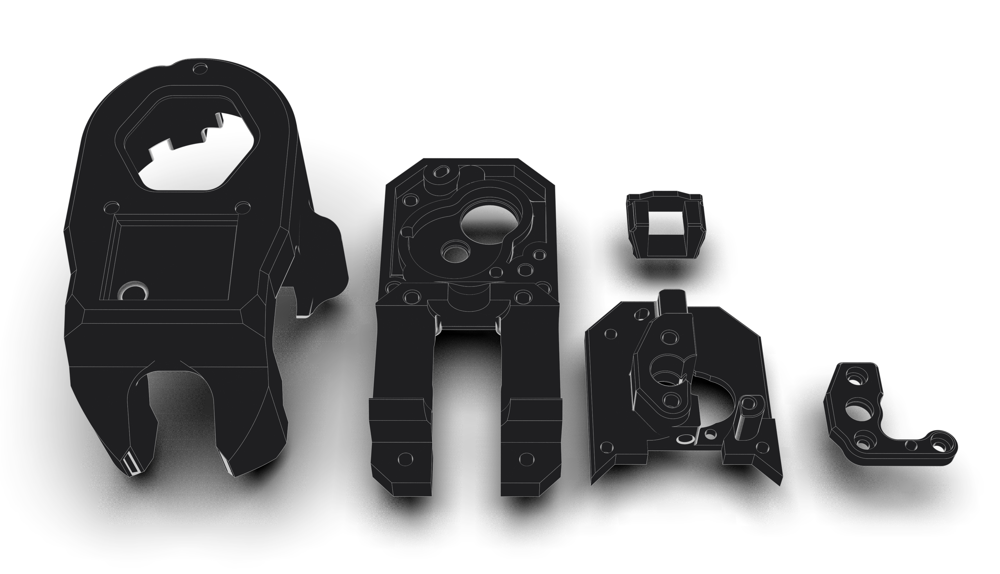
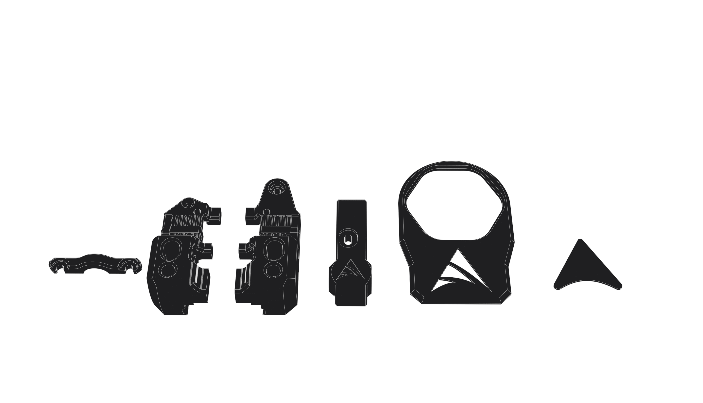

# Apex Flow Printed Parts

The STL files as well as the CAD files for the flow can be found [here](https://apexinvent.co.za/).

The main parts of the flow can be printed with FDM, however, we recommend our MJF-printed [Nylon kit](https://apexinvent.co.za/) for the main parts and ABS for the accent parts as well as the mount.

---

## Printed parts preview

### Main parts

### Accent parts and mount

---

The stock configuration for the flow is set up to be used on a CoreXY machine with an MGN12 front-mounted rail.
If you need to have it adapted to another machine a custom mount will need to be designed, if your machine is is not in the custom mounts section of our github and you are unable to design one yourself please reach out on our [Discord](https://discord.gg/vhEEsyMe3b) or [Whatsapp](https://chat.whatsapp.com/KzhH6vuGNllLFxyq71jtEv) and one of the community members may be able to assist.
